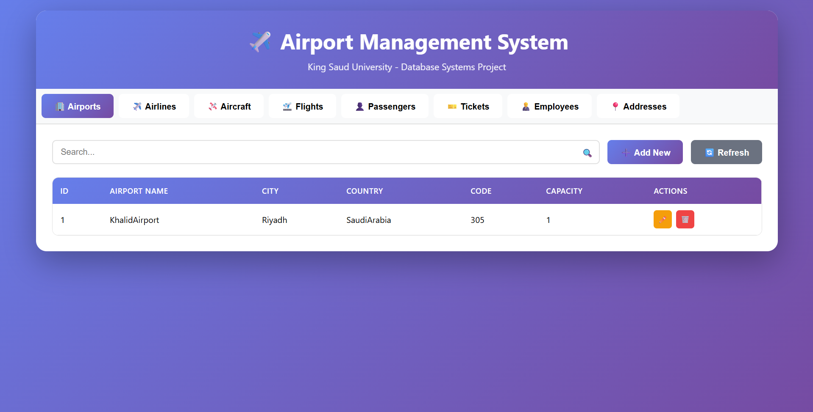
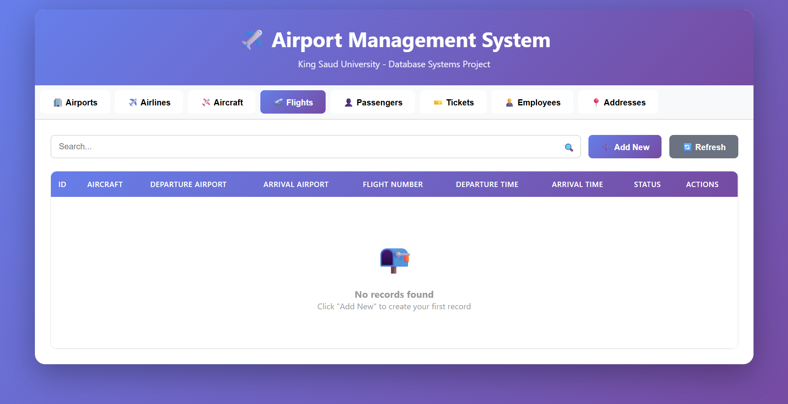

# ✈️ Airport Management System

A comprehensive database management system for airports, built as part of CSC380 Database Systems course at King Saud University.



## 📋 Project Overview

This project implements a complete relational database system for managing airport operations, including:
- ✈️ Airports and Airlines
- 🛩️ Aircraft Fleet Management
- 🛫 Flight Scheduling
- 👤 Passenger Management
- 🎫 Ticket Booking System
- 👨‍💼 Employee Management

## 🗄️ Database Design

### ER Diagram


### Database Schema
The system includes 8 interconnected tables:
- **Airport** - Airport information and locations
- **Airline** - Airline company details
- **Aircraft** - Aircraft fleet owned by airlines
- **Flight** - Flight schedules and routes
- **Passenger** - Passenger personal information
- **Ticket** - Booking and ticket details
- **Employee** - Airport staff information
- **Employee_Address** - Employee address details (1-to-1 relationship)

### Key Relationships
- One-to-One: Employee ↔ Employee_Address
- One-to-Many: Airline → Aircraft, Airport → Flight, Airport → Employee
- Many-to-Many: Passenger ↔ Flight (via Ticket)

## 🛠️ Technology Stack

- **Backend**: Python Flask
- **Database**: MySQL 8.0
- **Frontend**: HTML5, CSS3, JavaScript
- **Design**: Responsive, Modern UI with gradient themes

## ⚙️ Installation & Setup

### Prerequisites
- Python 3.7+
- MySQL Server 8.0+
- MySQL Workbench (optional)

### Step 1: Clone the Repository
```bash
git clone https://github.com/yourusername/airport-management-system.git
cd airport-management-system
```

### Step 2: Install Python Dependencies
```bash
pip install -r requirements.txt
```

### Step 3: Create Database
Open MySQL Workbench and run:
```sql
SOURCE database/schema.sql;
```

Or manually:
```sql
CREATE DATABASE phase1;
USE phase1;
-- Then copy paste the CREATE TABLE statements from schema.sql
```

### Step 4: Configure Database Connection
Edit `app.py` and update the database credentials:
```python
DB_CONFIG = {
    'host': 'localhost',
    'user': 'root',
    'password': 'YOUR_PASSWORD',  # Change this
    'database': 'phase1'
}
```

### Step 5: Run the Application
```bash
python app.py
```

### Step 6: Access the Application
Open your browser and navigate to:
```
http://localhost:5000
```

## 🎯 Features

### ✅ Full CRUD Operations
- **Create**: Add new records with validation
- **Read**: View all records with search functionality
- **Update**: Edit existing records
- **Delete**: Remove records with confirmation

### 🔍 Advanced Features
- **Foreign Key Dropdowns**: Automatic loading of related data
- **Search & Filter**: Real-time search across all fields
- **Responsive Design**: Works on desktop, tablet, and mobile
- **Error Handling**: User-friendly error messages
- **Data Validation**: Form validation before submission

## 📸 Screenshots

### Dashboard


### Managing Flights


### Adding Records


## 🎓 Academic Information

**Course**: CSC380 - Database Systems  
**Institution**: King Saud University  
**College**: Computer and Information Sciences  
**Phase**: Phase 2 - Application Demo  
**Academic Year**: 2024-2025

## 📄 Project Requirements Met

✅ GUI-based application  
✅ Database connectivity  
✅ Insert, Delete, Update, Search operations  
✅ ComboBoxes for foreign key selection  
✅ Proper UI components for displaying results  
✅ Fully functional demonstration  

## 🔮 Future Enhancements

- [ ] User authentication and authorization
- [ ] Real-time flight status updates
- [ ] Seat map visualization
- [ ] Report generation (PDF/Excel)
- [ ] Email notifications for bookings
- [ ] Multi-language support (Arabic/English)
- [ ] Mobile app version

## 📝 License

This project is developed for academic purposes as part of CSC380 course requirements.

